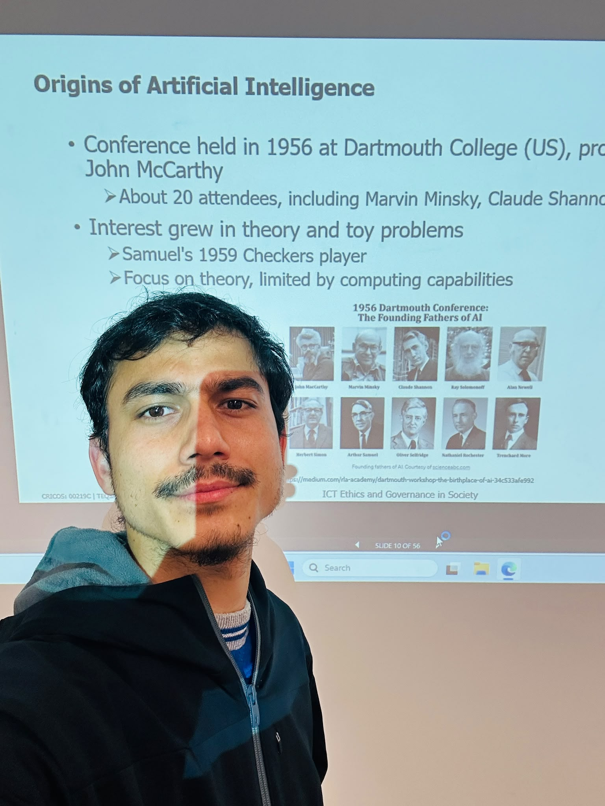
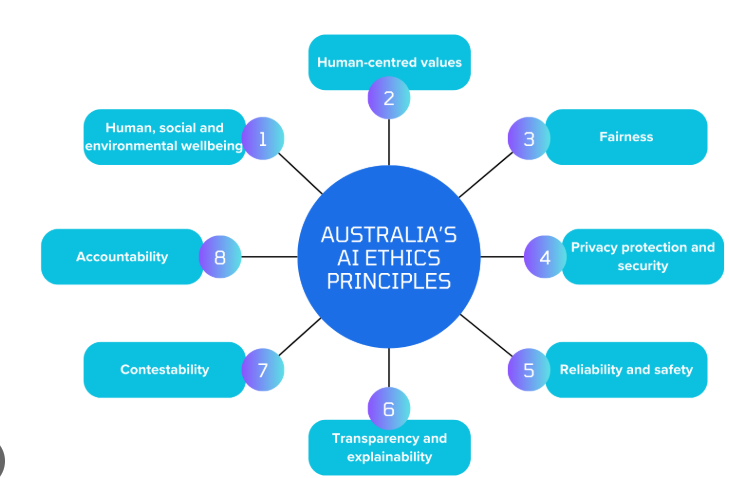
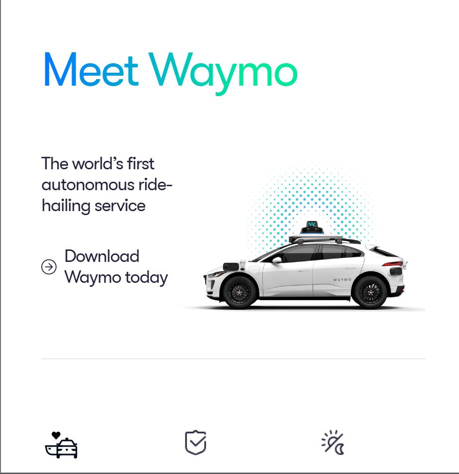
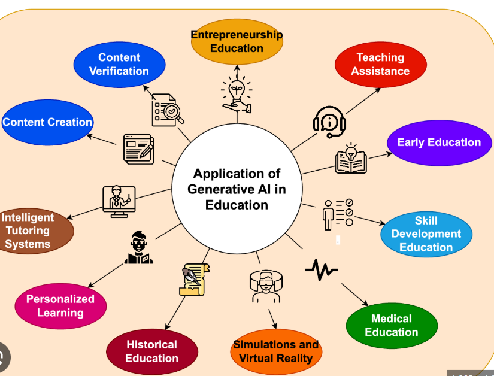

## Workshop Reflection
Before participating in Workshop 2, I had some knowledge of artificial intelligence, mainly about ChatGPT and self-driving cars, but I didn’t realize that AI is a broad and impactful area. Workshop 2 brought me to some major technologies underlying AI, such as machine learning, computer vision, robotics, speech recognition, and natural language processing. The discussions that took place during the session broadened my horizon about both the positive aspects of AI and ethical challenges, such as privacy, bias, fairness, transparency, and accountability. I was particularly interested in the question of how AI is being used for autonomous driving and healthcare, as in these cases I was able to see how AI can be beneficial to people and what ethical duties accompany that. I liked that the discussions gave me an opportunity to hear many points of view on the responsible use of AI. Overall, the workshop helped me get a broader understanding of AI and made me realize that I have to take responsibility for developing and using AI technologies as an ICT professional.
## Workshop Attendance Evidence

*Figure 1. Workshop 2 attendance photo.*
## Artefact 1 – Australia’s AI Ethics Principles
**Source:** Australian Government – Australia's AI Ethics Principles

The Australian Government has put together a document titled Australia’s AI ethics principles. It aims to provide guidance in the responsible manner of designing, developing and using AI technologies. Australia’s AI ethics principles emphasize that AI systems should be fair, transparent, reliable, safe and accountable while meeting human rights standards and protecting the privacy of people. Furthermore, the principles suggest how organizations as well as developers should think about the social implications of AI and gain the trust of the public when practicing the ethical use of AI technologies.

I selected this work because I learned that creating AI technologies concerns not only the invention of sophisticated technologies but also thinking of the implications of AI on human beings and society. I must admit that after listening to Workshop 2 on ethics in AI, I understood that fairness, transparency and accountability are among the main principles that should be followed so that AI technologies could be trustworthy.
## Artefact 2 – Waymo Driverless Cars

**Source:** Waymo Official Website

Summary

Waymo is an enterprise that is creating autonomous driving technology through the use of artificial intelligence. The self-driving vehicles work thanks to a range of different technologies: computer vision, machine learning, sensors and real-time data analysis among others. The goal of this technology is to decrease the number of mistakes performed by people, enhance safety on the roads and provide good transportation means. Therefore Waymo provides a valid example of how AI can be used in solving real-world problems. 

Reflection

I chose this artefact due to the fact that autonomous vehicles were among the most fascinating topics in Workshop 2. It allowed me to realize how AI is combining different technologies to make complicated decisions in a real-time mode. Even though the self-driving cars can change the car safety on the road and reduce the amount of accidents on the roads, they still cause serious ethical problems, such as accountability, public trust, and decision making in emergencies.
## Artefact 3 – Generative AI in Education

**Source:** (Use the article or webpage you selected about Generative AI in Education)

Summary

Generative AI is revolutionising the very fabric of education as well as assisting students and teachers with chores such as creation of content, adaptation of learning, provision of feedback, and performing research. Programs such as ChatGPT have proved to be useful in increasing the effectiveness of education as they help make explanations, provide answers to questions and help with writing itself. Nevertheless, the use of generative AI brings about worries regarding issues like academic integrity, misinformation, privacy, and overdependence on AI-generated content. Thus, it is essential to use generative AI responsibly and formulate ethical resolutions to ensure that AI is used for the purpose of assisting in learning and not replacing thinking processes undertaken by the individual.

Reflection

I opted for this artefact as I believe that generative AI is becoming more and more relevant nowadays and has direct implications for my studies in Information Technology. I found out during Workshop 2 that AI can only be benefited from in a responsible and ethically correct manner. This artefact allowed me to see both the benefits of generative AI in the field of education along with the dangers connected with the application of AI for educational purposes.
## Artefact 4 – Workshop Activity and Personal Learning
**Source:** My Workshop 2 participation and notes

*Figure 4. Workshop 2 participation and attendance.*

Summary

In the second workshop, I took part in the discussions as well as activities concerning artificial intelligence (AI) and its effect on society. The workshop consisted of topics such as machine learning, computer vision, robotics, speech recognition and natural language processing. The workshop also dealt with ethical issues appearing from AI such as privacy, bias, fairness, transparency and accountability. The activities allowed the students to think critically about the appropriate way of using the technology. 

Reflection

This is the artefact I selected because it shows my learning experience at the second workshop. Discussions about the issues connected with AI made me realise that AI is an important technology which has to be used properly. After hearing the opinions of other participants in the workshop, I understood better the ethical issues associated with such technologies as AI.
## References

Australian Government. (2024). *Australia's AI Ethics Principles*.

Waymo. (2024). *Waymo Official Website*.

(Your Generative AI article reference in CQUniversity Harvard style.)
